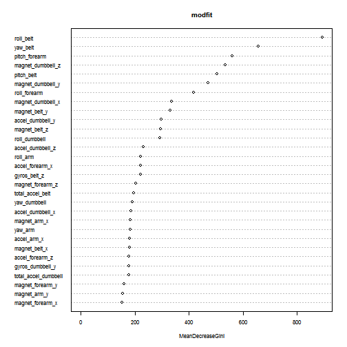

Practical Machine Learning Peer Review Assignment
========================================================
## Synopsis

Using devices such as Jawbone Up, Nike FuelBand, and Fitbit it is now possible to collect a large amount of data about personal activity relatively inexpensively. These type of devices are part of the quantified self movement - a group of enthusiasts who take measurements about themselves regularly to improve their health, to find patterns in their behavior, or because they are tech geeks. One thing that people regularly do is quantify how much of a particular activity they do, but they rarely quantify how well they do it. 

In this project, people were asked to perform barbell lifts correctly and incorrectly in 5 different ways. Our goal is using data from accelerometers on the belt, forearm, arm, and dumbell of 6 participants to predict the category of movement that human text subjects intentionally exhibited when performing a simple physical exercise, based on sensor data. I will start from trimming the data sets, then establish and cross validate a predictive model from pml-train.csv using random forest algoritm, and use the model to predit the unlabeled data set pml-test.csv.

More information is available from the website here: http://groupware.les.inf.puc-rio.br/har  


## Download files

```r
if (!file.exists("./pml-training.csv")) {
    download.file("https://d396qusza40orc.cloudfront.net/predmachlearn/pml-training.csv", 
              "pml-training.csv", method = "curl")
}

if (!file.exists("./pml-testing.csv")) {
download.file("https://d396qusza40orc.cloudfront.net/predmachlearn/pml-testing.csv", 
              "pml-testing.csv", method = "curl")
}
```

## Read training and testing csv files

```r
rawtraining <- read.csv("pml-training.csv", na.strings = c("NA", ""))
rawtesting <- read.csv("pml-testing.csv", na.strings = c("NA", ""))
```
check the size of data

```r
dim(rawtraining); dim(rawtesting)
```

```
## [1] 19622   160
```

```
## [1]  20 160
```

```r
m <- ncol(rawtraining)
```

## Trimming the data to prevent overfitting

There are 160 variables in boths data sets. However, not all of them are useful. 

### Remove the unuseful columns (personal information, time stamps, etc.) and empty columns

```r
rmcols1 <- grep("timestamp|X|user_name|new_window|num_window",names(rawtraining))
train1 <- rawtraining[, -rmcols1]
rmcols2 <- grep("timestamp|X|user_name|new_window|num_window",names(rawtesting))
test1 <- rawtesting[, -rmcols2] ## remove unuseful

rmnacols1 <- colSums(is.na(train1))
train2 <- train1[, rmnacols1 == 0]
rmnacols2 <- colSums(is.na(test1))
test2 <- test1[, rmnacols2 ==0] ## remove NAs
```

### Remove the highly correlated variable pairs

```r
library(caret)
```

```
## Loading required package: lattice
## Loading required package: ggplot2
```

```r
library(corrplot)

corMatrix <- cor(train2[, -ncol(train2)])
corrplot(corMatrix, method = "circle", type = "lower", tl.cex = 0.7)
```

 

```r
highCorr <- findCorrelation(corMatrix, cutoff = 0.99)    ## high correlation cutoff = 0.9
train3 <- cbind(train2[, -highCorr])    
test3 <- test2[, -highCorr]  ## remove highly correlated pairs
n <- ncol(train3)
rm(rawtraining); rm(rawtesting);rm(train1); rm(train2); rm(test1); rm(test2) ## release memory
```
From the correlation figure, most of the predictors do not exhibit high correlation. Nonetheless, there are still a few variables that are highly correlated with another. They are removed for preventin overfitting.

Now the train data set has 52 variables left (including classe).

## Establish and validate predictive model

In this report, random forest algorithm was used for prediction.

### split train data into training and testing

```r
set.seed(12345)
inTrain <- createDataPartition(train3$classe, p = 0.7, list = F)
training <- train3[inTrain, ]
testing <- train3[-inTrain, ]
```

### predictive model: random forest

```r
library(randomForest)
```

```
## randomForest 4.6-7
## Type rfNews() to see new features/changes/bug fixes.
```

```r
set.seed(67890)
modfit <<- randomForest(classe ~ ., data = training)
varImpPlot(modfit, cex = .7)
```

 

```r
modfit
```

```
## 
## Call:
##  randomForest(formula = classe ~ ., data = training) 
##                Type of random forest: classification
##                      Number of trees: 500
## No. of variables tried at each split: 7
## 
##         OOB estimate of  error rate: 0.52%
## Confusion matrix:
##      A    B    C    D    E class.error
## A 3904    1    0    0    1    0.000512
## B   15 2638    5    0    0    0.007524
## C    0   17 2374    5    0    0.009182
## D    0    0   19 2232    1    0.008881
## E    0    0    1    7 2517    0.003168
```
The confusion matrix output shows how well the model predicted/classified the values in the training set.

### Cross validation testing and out-of-sample error estimate

```r
crosstest <- predict(modfit, testing)
confusionMatrix(testing$classe, crosstest)$table
```

```
##           Reference
## Prediction    A    B    C    D    E
##          A 1673    1    0    0    0
##          B   10 1126    3    0    0
##          C    0   10 1014    2    0
##          D    0    0   14  950    0
##          E    0    0    0    5 1077
```

```r
accuracy <- postResample(testing$classe, crosstest)
accuracy 
```

```
## Accuracy    Kappa 
##   0.9924   0.9903
```
The confusion matrix output shows how well the model predicted/classified the values in the cross validation data set.


## Saving answers for auto grader

```r
answers <- predict(modfit, test3)
pml_write_files = function(x){
    n = length(x)
    for(i in 1:n){
        filename = paste0("problem_id_",i,".txt")
        write.table(x[i],file=filename,quote=FALSE,row.names=FALSE,col.names=FALSE)
    }
}
pml_write_files(answers)
```
The answer saved achieved the 100% accuracy by auto grader.

